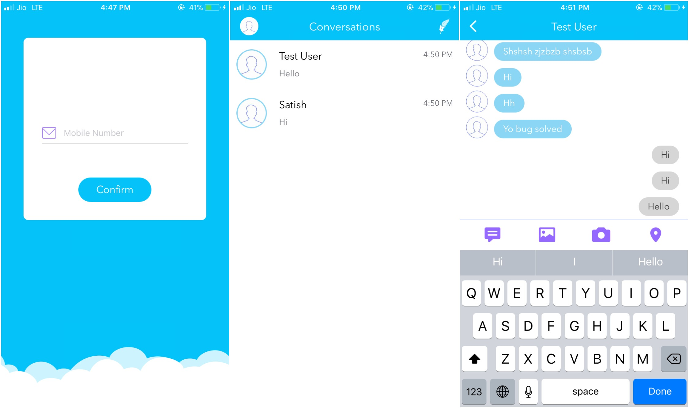

# **Depreciated** 
## Use this New Project https://github.com/satishbabariya/Chatter

# Firebase-Chat-Demo

Firebase Chat Demo for iOS is a real time chat app based on Firebase and OTP Authendication , Also User can directly chat with their phone contacts whose using also this app.

Firebase Chat Demo to send and receive text messages, photos & location. also it allows you to connect with people in your phone contacts.

# Features

Mobile Number Authentication
User Status
Multimedia Messages
Fetch all Contacts From Phone 
Pretty Much Like Whatsapp, Hike, QQ and so on...

<h3 align="center">

</h3>

## Getting Started

To get started and run the app, you need to follow these simple steps:

1. Open the QuickChat workspace in Xcode.
2. Change the Bundle Identifier to match your domain.
3. Go to [Firebase](https://firebase.google.com) and create new project.
4. Select "Add Firebase to your iOS app" option, type the bundle Identifier & click continue.
5. Download "GoogleService-Info.plist" file and add to the project. Make sure file name is "GoogleService-Info.plist".
6. Go to [Firebase Console](https://console.firebase.google.com), select your project, choose "Authentication" from left menu, select "SIGN-IN METHOD" and enable "Phone Number " option.
7. In Xcode, enable push notifications for your project.
8. Upload your APNs authentication key to Firebase. If you don't already have an APNs authentication key, see [Configuring APNs with FCM](https://firebase.google.com/docs/cloud-messaging/ios/certs).

 8.1. Inside your project in the Firebase console, select the gear icon, select Project Settings, and then select the Cloud    Messaging tab.
 8.2. In APNs authentication key under iOS app configuration, click the Upload button.
 8.3. Browse to the location where you saved your key, select it, and click Open. Add the key ID for the key (available in Certificates, Identifiers & Profiles in the Apple Developer Member Center) and click Upload.

If you already have an APNs certificate, you can upload the certificate instead.

9. Open the terminal, navigate to project folder and run "pod update". 
10. You're all set! Run Firebase Chat Demo on your iPhone or the iOS Simulator.

## Compatibility

This project is written in Swift 3.0 and requires Xcode 8.2 to build and run.

Quick Chat for iOS is compatible with iOS 9.1+.

## Declaration

This Demo app is modifided From Quick-Chat.

## Author

Satish Babariya, satish.babariya@gmail.com

## License

SwiftyContacts is available under the MIT license. See the LICENSE file for more info.
